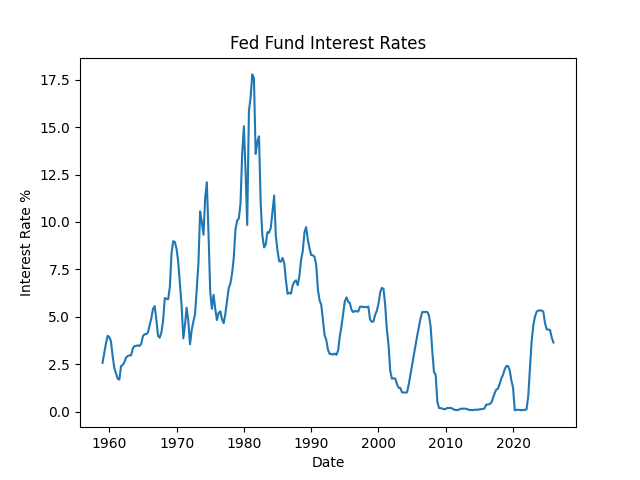
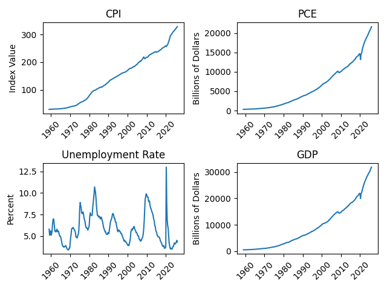
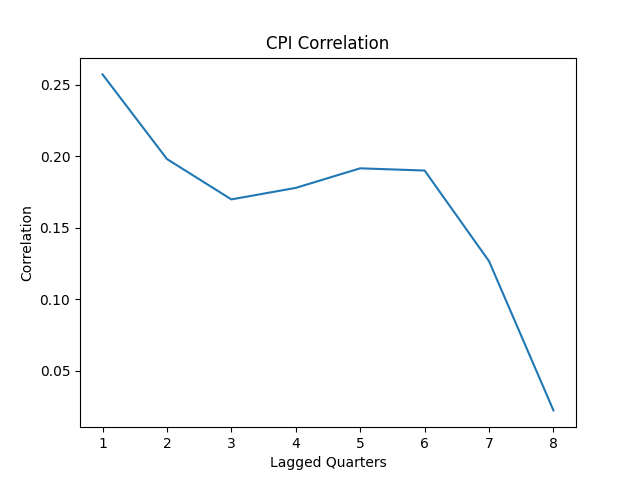
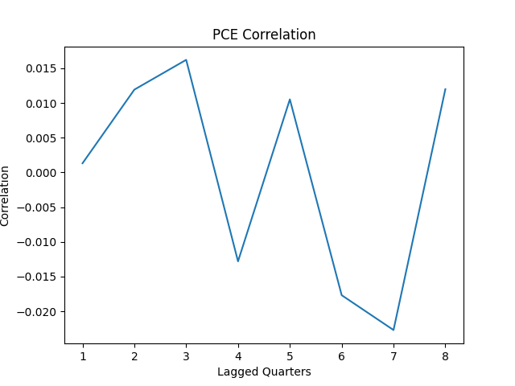
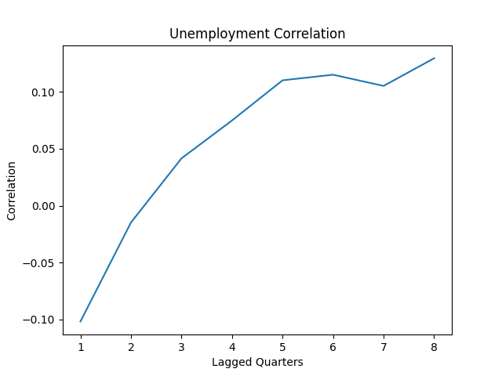
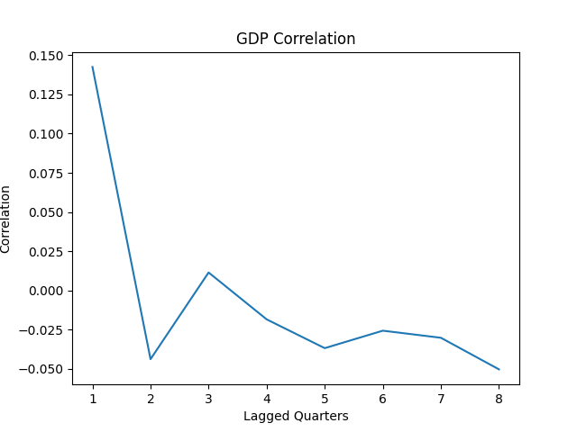
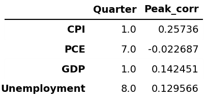

# Financial Analytics Project: Exploring Federal Funds Rate Impacts on Macroeconomic Indicators
### **Nicholas Evans** 
## Project Overview
The Federal Funds Rate is one of the primary tools the Federal Reserve utilizes for implementing monetary policy and is adjusted to influence inflation, employment, and overall economic output. While the effects of monetary policy are well understood conceptually, they are generally expected to occur with a delay rather than immediately. This project explores whether lagged relationships between Federal Funds Rate changes and major macroeconomic indicators can be identified through exploratory time-series analysis.

Federal Economic data is a topic I have become particularly interested in as the Federal Reserve underwent a regime change during the time of this project's development. Becoming more educated on the topic has captured my focus, and what better way to put my analytical skills to use than to produce an analysis of the effects of Monetary Policy on output. Intuitively, it made sense that the effects of Monetary Policy adjustment, specifically the Federal Funds Interest Rate, would have a lagged impact on Macroeconomics, which was something that I wanted to explore and potentially verify with this project. 

## Research Question
### How do changes in the Federal Funds Rate relate to subsequent changes in CPI, PCE, GDP, and the unemployment rate over multiple quarterly lag intervals?

## Project Workflow
1. Historical observations were downloaded from the Federal Reserve Economic Data (FRED) website and imported into a **MySQL database** for transformation and analysis.
2. Designed a MySQL relational database schema and developed an **ETL pipeline** to store & utilize indicator metadata and historical observations.
3. Generated 2 analytics-ready datasets through SQL transformations using **Common Table Expressions (CTEs) and SQL Views** to standardize reporting frequencies and engineer quarterly aggregated data.
4. Performed exploratory data analysis in Python through summary statistics, missing value assessment, and **time-series visualizations**.
5. Engineered lag features and quarter-over-quarter change variables to evaluate delayed monetary policy effects.
6. Implemented a reusable lag **parameter search algorithm** to calculate Pearson correlation coefficients across one-to eight-quarter lags to identify the strongest observed relationship for each indicator.
7. Interpreted the results, discussed the statistical limitations of the findings, and identified opportunities for future research.
   
## Skills Demonstrated

### SQL
- Relational Database Design
- Common Table Expressions (CTEs)
- SQL Views
- Window Functions 'Lag()'
- Data Aggregation
- ETL Pipeline Development

### Python
- Pandas
- Matplotlib
- Seaborn
- Time-Series Data Analysis
- Feature Engineering

### Data Analytics
- Exploratory Data Analysis (EDA)
- Data Cleaning & Preprocessing
- Lag Feature Engineering
- Pearson Correlation Analysis
- Statistical Interpretation
- Data Visualization

## MySQL Database Design

## Data Engineering
To prepare the data for analysis, I standardized indicator frequencies and engineered the data for downstream analytics. Using Common Table Expressions to initially demonstrate the logic for aggregations and then generated Views to display Short & Long formatted tables for modeling & visualizations. These transformations were implemented in the [QueryingDB.sql](./sql/QueryingDB.sql) file utilizing a combination of Common Table Expressions (CTEs) and SQL Views, creating 2 reusable analytical datasets for downstream visualization and analysis. 

**Created Common Table Expressions (CTEs):** 
- Aggregating monthly observations into calendar-quarter averages while preserving existing quarterly observations and  producing a standardized dataset for time-series analysis.
- Obtaining Value & Percentage Change Statistics for Each Observation, incorporating the LAG() window function

**Created SQL Views:**
Two analytical views were created to support different stages of the project:
- Quarterly aggregated View of Indicator Values and Percentage Change Statistics in a long table format [macroeconomic_data_long.csv](./data/processed/macroeconomic_data_long.csv), designed for flexible visualization and business intelligence applications.
- Quarterly aggregated View of Indicator Values in a short table format with Columns: year, quarter, fed_funds_rate, cpi, gdp, pce, where [macroeconomic_data_short.csv](./data/processed/macroeconomic_data_short.csv) is optimized for exploratory data analysis, feature engineering, and lagged correlation analysis.

Although both long and wide formatted datasets were generated during the SQL transformation pipeline, the wide-format (macroeconomic_data_short) view was used for all subsequent exploratory analysis and lagged correlation modeling, as each indicator needed to exist as a separate variable for statistical comparison. The long table was generated for Power BI dashboarding if the analysis yielded insights requiring such. 

## Exploratory Data Analysis
The exploratory analysis examined the completeness, distribution, and long-term behavior of each macroeconomic indicator before feature engineering. Summary statistics were used to understand variable scale and dispersion, while time-series visualizations identified long-term trends, cyclical behavior, and potential structural differences across indicators.

### Federal Funds Rate
  
Visualizing the Federal Funds Rate Observations over time, it's evident that changes occur cyclically, delineating periods of expansionary and contractionary monetary policy. The Tightening cycle of the 1980s represents a notable peak in the dataset, with interest rates reaching historically elevated levels as the Federal Reserve implemented restrictive monetary policy to address high inflation. Outside of this period, the Federal Funds Rate generally remained below 10% throughout the observed timeframe, with subsequent cycles reflecting changes in the broader economic environment and inflation conditions.

### Macroeconomic Indicators
  
Visualizing each macroeconomic indicator over time highlights the distinct long-term trends and cyclical patterns present across the dataset. GDP demonstrates a strong upward trend over time, reflecting overall economic expansion, while CPI and PCE exhibit gradual increases consistent with long-term inflationary trends. Short-term declines or disruptions are visible during recessionary periods, where economic activity and inflation dynamics can shift. In contrast, unemployment figures are more volatile, as they are expressed as a percentage rate and respond more quickly to changes in labor market conditions. These differences in scale and economic behavior emphasize the importance of carefully considering each indicator's context when evaluating their relationships with Federal Funds Rate movements.

## Feature Engineering
To evaluate the delayed effects of monetary policy, additional analytical features were engineered from the transformed quarterly dataset. Before engineering new features, observations containing missing values were removed to ensure each correlation calculation was performed using complete quarterly observations across all macroeconomic indicators. Missing values were expected because each indicator began reporting at different points in time.

Engineered features included:

- Quarter-over-quarter (QoQ) change variables for the Federal Funds Rate, GDP, CPI, PCE, and Unemployment Rate to analyze changes rather than absolute levels.
- Dynamically generated lagged Federal Funds Rate features using Pandas' `.shift()` function to evaluate delayed relationships across one- to eight-quarter intervals.

These engineered features enabled the analysis to compare changes in monetary policy with subsequent changes in macroeconomic indicators through lagged Pearson correlation analysis.

## Methodology
The analysis evaluated the lagged relationship by displaying a historical line graph showing the Pearson correlation coefficient between lagged changes in FedFund Rates and changes to each macro-indicator metric generated from Pandas' .corr() function. Correlations were computed across lag intervals ranging from one to eight quarters and visualized to identify the timing of the strongest observed statistical association. To keep the scope of the project manageable, I chose 8 quarters as the maximum length, limiting the evaluation to a timeframe that remains economically interpretable. This analysis utilized a reusable parameter search algorithm function, which generated a lagged column for each FedFund Interest Rate interval and then stored each Pearson coefficient for display. Lagged analysis was the chosen methodology for this project since monetary policy changes are expected to have a delayed rather than immediate impact on macroeconomic figures. 

## Results & Key Findings
The focus of this analysis centered upon the lagged relationship between changes in the Federal Funds Rate and four key macroeconomic indicators: CPI, PCE, Unemployment, and GDP. By engineering quarterly lag features and comparing correlations across multiple time horizons, the analysis examined how the timing of monetary policy aligns with different aspects of macroeconomic performance. The results indicate that macroeconomic indicators do not respond uniformly to Federal Funds Rate changes, with CPI demonstrating the strongest observed relationship at a short-term lag, while unemployment exhibited its highest observed correlation at a longer lag interval. However, the correlation values all remained weak, suggesting that looking strictly at Federal Funds Rate changes provides limited insight into movements in these macroeconomic indicators. These findings highlight the complexity of monetary policy transmission within the broader economy and emphasize that economic outcomes are influenced by multiple factors beyond interest rate adjustments.

### Lagged Impact Analysis of Fed Funds Interest Rates on CPI
  
Interpreting this Plot, it's visible that the correlation between the Fed Funds Interest Rate changes and Consumer Price Index growth is strongest at the 1-quarter mark within a 2-year time frame. The relationship consistently weakens as the lag interval increases, suggesting that changes in the Federal Funds Rate are more closely associated with CPI movements in the near term than over longer horizons. While this analysis identifies the timing of the strongest relationship, correlation alone does not establish a causal effect. The correlation also remains weak, indicating that Federal Funds Rate changes alone explain limited variation in CPI growth. 

### Lagged Impact Analysis of Fed Funds Interest Rates on PCE
  
Interpreting this plot, the strongest observed correlation between Federal Funds Rate changes and quarterly changes in Personal Consumption Expenditures (PCE) occurs at the 7-quarter lag interval within the 2-year analysis window. However, unlike the CPI analysis, the relationship does not follow a consistent pattern as the lag interval increases. While the lag analysis identifies the interval with the strongest observed correlation, the weakness of the overall relationship indicates that PCE movements are likely influenced by additional economic factors beyond monetary policy changes.

### Lagged Impact Analysis of Fed Funds Interest Rates on Unemployment
  
Interpreting the resulting plot, the strongest observed correlation between Federal Funds Rate changes and quarter-over-quarter changes in the Unemployment Rate occurs at the 8-quarter lag within the two-year analysis window. Although the correlation reaches its highest value at the longest tested lag interval, the relationship does not display a strong or consistent pattern across the lag periods analyzed. Since the strongest observed correlation occurs at the maximum tested lag of 8 quarters, expanding the analysis window could provide additional insight into whether a longer-term relationship exists. However, the correlation remains very weak, indicating that Federal Funds Rate changes have limited linear association with changes in the Unemployment Rate within this dataset.

### Lagged Impact Analysis of Fed Funds Interest Rates on GDP
  
Interpreting the resulting plot, the strongest observed correlation between Federal Funds Rate changes and quarter-over-quarter changes in Gross Domestic Product (GDP) occurs at the 1-quarter lag within the two-year analysis window. The relationship generally weakens as the lag interval increases, suggesting that the observed association between monetary policy changes and GDP growth does not persist strongly over longer time horizons. However, the correlation remains weak, indicating that Federal Funds Rate adjustments alone explain limited variation in GDP growth. As with the other analyses, these findings identify statistical associations rather than causal effects.

### Final Conclusions on Results
  
The focus of this analysis centered upon the lagged relationship between changes in the Federal Funds Rate and four key macroeconomic indicators: **CPI, PCE, Unemployment, and GDP**. By engineering quarterly lag features and comparing correlations across multiple time horizons, the analysis examined how the timing of monetary policy aligns with different aspects of macroeconomic performance. The results indicate that macroeconomic indicators do not respond uniformly to Federal Funds Rate changes, with CPI demonstrating the strongest observed relationship at a short-term lag, while unemployment exhibited its highest observed correlation at a longer lag interval. However, the correlation values all remained weak, suggesting that looking strictly at Federal Funds Rate changes provides limited insight into movements in these macroeconomic indicators. These findings highlight the complexity of monetary policy transmission within the broader economy and emphasize that economic outcomes are influenced by multiple factors beyond interest rate adjustments.

## Limitations
The results of this analysis demonstrate the value of lagged feature engineering and descriptive time-series analysis when evaluating macroeconomic data. This is important, since delayed relationships may not be evident when comparing interest rates with macroeconomic indicators contemporaneously. However, the content of this analysis is exploratory and should be interpreted with caution. Correlation measures statistical association rather than causation, and many external factors, including fiscal policy, global economic conditions, supply chain disruptions, and business cycles, can influence macroeconomic outcomes. Additionally, the relatively weak correlation metrics limit the strength of conclusions that can be drawn from this analysis alone.

## Future Improvements
Several opportunities exist to extend this analysis and potentially discover deeper insights. Future work could evaluate longer lag intervals to determine whether stronger relationships emerge beyond two years, particularly for indicators where longer lags produced increasing correlations. More advanced statistical techniques, such as multiple linear regression or time-series forecasting models, could provide a more rigorous evaluation of the dynamic relationships between monetary policy and macroeconomic indicators. Additional macroeconomic indicators, including housing activity and consumer confidence metrics, could also be incorporated to broaden the scope of analysis of monetary policy transmission throughout the economy.

## References
All data was gathered from the Federal Reserve Bank of St Louis Economic Database
- **Federal Funds Effective Rate (FEDFUNDS):** https://fred.stlouisfed.org/series/FEDFUNDS
- **Unemployment Rate (UNRATE):** https://fred.stlouisfed.org/series/UNRATE
- **Gross Domestic Product (GDP):** https://fred.stlouisfed.org/series/GDP
- **Consumer Price Index (CPI):** https://fred.stlouisfed.org/series/CPIAUCSL
- **Personal Consumption Expenditures (PCE):** https://fred.stlouisfed.org/series/PCE

