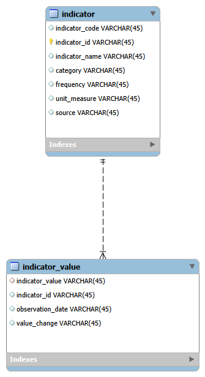

# FedFund Interest Rate & Macroeconomic Analysis: Evaluating the Relationship Between Federal Funds Rate Changes and Macroeconomic Indicators

## Project Overview
The Federal Funds Rate is the Federal Reserve's primary monetary policy tool and is widely used to influence inflation, employment, and overall economic activity. While the effects of monetary policy are well understood conceptually, they are generally expected to occur with a delay rather than immediately. This project explores whether lagged relationships between Federal Funds Rate changes and major macroeconomic indicators can be identified through exploratory time-series analysis.

Federal Economic data is a topic I have become particularly interested in with the Federal Reserve undergoing a regime change during the time of this project's development. Becoming more educated on the topic has captured my focus, and what better way to put my analytical skills to use than to produce an analysis of the effects of Monetary Policy on the Macro Economy. Intuitively, it made sense that the effects of Monetary Policy changes, specifically the Federal Funds Interest Rate, would have a lagged impact on Macroeconomics, which was something that I wanted to explore and potentially verify with this project. 

## Research Question
### How do changes in the Federal Funds Rate relate to subsequent changes in CPI, PCE, GDP, and the unemployment rate over multiple quarterly lag intervals?

## Project Workflow
Data 
## Technologies Used
Languages: Python, SQL
Libraries: Pandas, Matplotlib

## Database Design

## Data Engineering

## Exploratory Data Analysis

## Feature Engineering

## Methodology
The analysis evaluated the lagged relationship by displaying a historical line graph showing the Pearson correlation coefficient between lagged changes in FedFund Rates and changes to each macro-indicator metric generated from Pandas' .corr() function. Correlations were computed across lag intervals ranging from one to eight quarters and visualized to identify the timing of the strongest observed statistical association. To keep the scope of the project manageable, I chose 8 quarters as the maximum length, limiting the evaluation to a timeframe that remains economically interpretable. This analysis utilized a reusable parameter search algorithm function, which generated a lagged column for each FedFund Interest Rate interval and then stored each Pearson coefficient for display. Lagged analysis was the chosen methodology for this project since monetary policy changes are expected to have a delayed rather than immediate impact on macroeconomic figures. 

## Results

## Key Findings

## Limitations

## Future Improvements

## References
